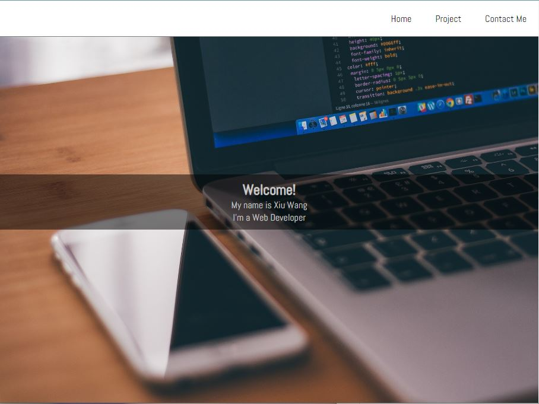

# FreeCodeCamps - Personal Portfolio Project

### Project Requirements
 - Welcome section
   -The height of the welcome section should be equal to the height of the viewport
 - Project section 
   - contain projects
   - contain link to projects 
 - Navbar section 
   - contain clickable link navigate to different sections of the page
   - Always at the top of the viewport
 - Contain a link that opens GitHub or FCC profile in a new tab
 - At lease one media query is required
 
 ### Original Project Requirement
 https://learn.freecodecamp.org/responsive-web-design/responsive-web-design-projects/build-a-personal-portfolio-webpage
